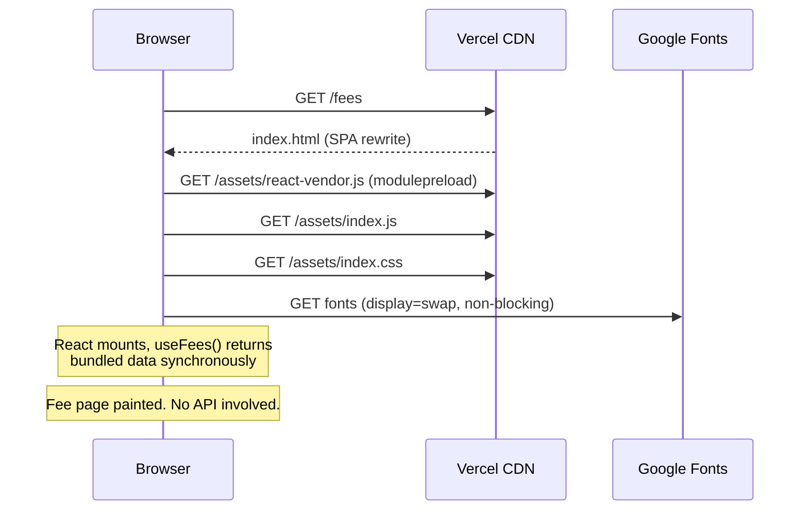
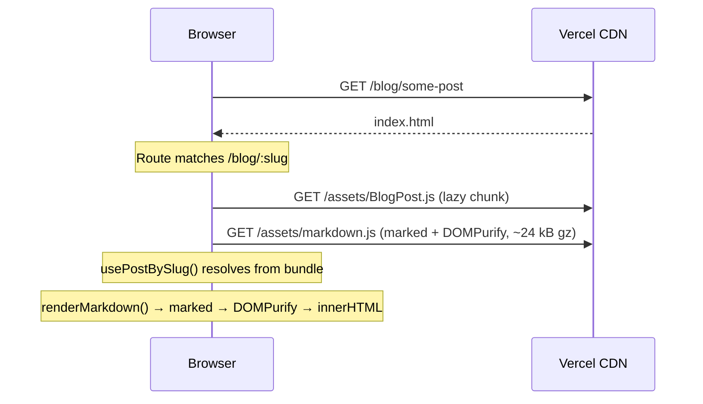
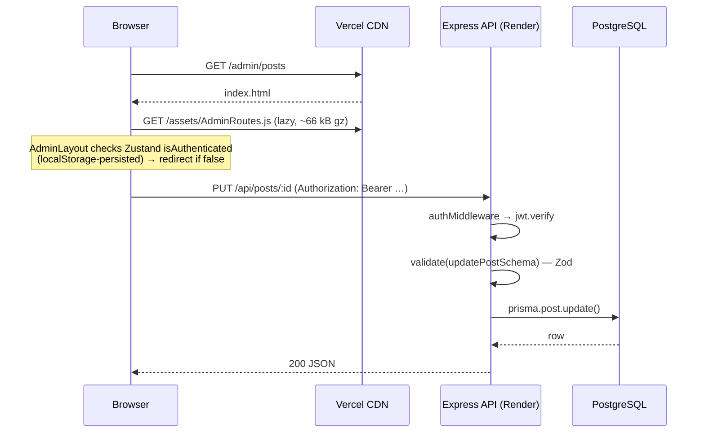

# System Architecture

> IPR Central website — architecture, data flow, technology stack and the
> reasoning behind the current design.
>
> Companion documents: [C4-DIAGRAMS.md](C4-DIAGRAMS.md) ·
> [UI-UX.md](UI-UX.md) · [FEATURES.md](FEATURES.md) ·
> [DEPLOYMENT.md](DEPLOYMENT.md)

---

## 1. What this system is

A brochure-and-blog website for an intellectual property consultancy, plus an
optional admin panel for editing its content.

It has two distinct audiences with almost nothing in common:

| | Public site | Admin panel |
|---|---|---|
| Audience | Prospective clients | One administrator |
| Traffic | All of it | Effectively zero |
| Availability requirement | Absolute | Best-effort |
| Needs a database | No | Yes |
| Route | `/`, `/services`, `/fees`, … | `/admin/*` |

Almost every architectural decision below follows from taking that split
seriously.

---

## 2. The problem this architecture solves

### What the previous design did

Every public page fetched its content from an Express API backed by PostgreSQL,
on mount, before rendering anything:

```
Visitor → index.html → JS boots → useEffect fires → fetch /api/settings
                                                   → fetch /api/posts
                                          ⟳ spinner until both resolve
```

`Home`, `About`, `Contact`, `Fees`, `Blog`, `BlogPost` and the site-wide `Footer`
each did this independently. The footer refetched settings on **every**
navigation, with no cache and no shared state.

### Why that failed

Measured against the deployed API on 2026-08-23:

```
GET  https://ipr-zenith-hub.onrender.com/health         → 200 in 32.3 s
GET  https://ipr-zenith-hub.onrender.com/api/settings   → 500
GET  https://ipr-zenith-hub.onrender.com/api/posts      → 500
GET  https://ipr-zenith-hub.onrender.com/api/fees       → 500
POST https://ipr-zenith-hub.onrender.com/api/auth/login → 500
```

Two independent failures compounding:

1. **Cold start.** The API is on a free tier that spins down after idle. The
   first visitor after a quiet period waited **32 seconds** looking at a spinner
   before any content appeared.
2. **Database gone.** The Express process was alive, but every route that touched
   Postgres returned 500. The free-tier database had expired.

The visible result was a homepage reading *"Failed to load content. Please try
again later."* A retry button that could not succeed. A fee page with no fees. An
admin panel whose login always failed.

The root cause is architectural, not operational: **a brochure site had been
given a hard runtime dependency on a stateful backend it did not need.** Nothing
on the public site is per-visitor, personalised, or transactional. It is the same
bytes for everyone. It never needed a database in the request path.

### What the current design does

```
Visitor → index.html → JS boots → renders immediately from bundled content
                                  (no request, no spinner, no failure mode)
```

Content lives in `src/content/` as typed TypeScript, compiled into the bundle at
build time. The site's availability is now the availability of a CDN.

---

## 3. Content architecture

### The content layer

```
src/content/
├── site.ts             Firm identity, contact details, WhatsApp number, SEO defaults
├── home.ts             Hero copy, value propositions
├── services.ts         Service offerings
├── practice-areas.ts   Practice area detail (ids double as anchor targets)
├── about.ts            Mission, values, milestones
├── fees.ts             Fee schedule, category ordering, pricing caveats
├── posts.ts            Blog posts with Markdown bodies
└── legal.ts            Privacy policy and terms of service
```

Two things made this worth doing beyond removing the network dependency:

- **Page components previously held content inline.** `Services.tsx` and
  `PracticeAreas.tsx` had large content arrays declared above the component.
  Editing a service description meant editing JSX. Content and presentation are
  now separate concerns in separate files.
- **It is typed.** `fees.ts` satisfies `FeeItem[]`, `posts.ts` satisfies
  `Post[]` — the same interfaces the API returns. A malformed fee item is a
  compile error rather than a blank card in production.

### Static-first with optional revalidation

`src/lib/content.ts` is the single access point. Its core is deliberately small:

```ts
function useRevalidated<T>(initial: T, fetcher: () => Promise<T>): T {
  const [value, setValue] = useState<T>(initial);   // ← paints on frame 1

  useEffect(() => {
    if (!LIVE_CONTENT_ENABLED) return;              // ← default: no request at all
    fetcher()
      .then((fresh) => { if (fresh) setValue(fresh); })
      .catch(() => { /* the static content on screen is already correct */ });
  }, []);

  return value;
}
```

This is stale-while-revalidate with the bundle as a permanent floor. The
important property is what it does **not** expose: there is no `isLoading` and no
`error` in the return type, so no consumer can accidentally reintroduce a
blocking spinner or an error page.

| `VITE_ENABLE_LIVE_CONTENT` | Public site behaviour |
|---|---|
| unset / `false` *(default)* | Fully static. Zero requests. |
| `true` | Static paint, then background refresh from the API. |

The admin panel bypasses this module entirely and calls `src/lib/api.ts`
directly, so it is unaffected by the flag — it works whenever the API works.

### Consequence: two sources of truth

With live content enabled, the bundle and the database can diverge: an admin edit
appears on the live site immediately, but the next deploy rebuilds from
`src/content/` and reverts it.

This is a genuine trade-off, accepted deliberately, and the mitigation is simple:
**treat `src/content/` as the source of truth** and use the admin panel for
preview or for content you intend to copy back. The alternative — making the
database authoritative — reintroduces exactly the availability coupling this
design removes.

---

## 4. Request and data flow

### Public page load (default configuration)



### Blog post load



The markdown chunk is loaded only on this route. Keeping `BlogPost` lazy is what
stops Vite emitting a `modulepreload` for it on every page in the site.

### Admin write



---

## 5. Technology stack

### Frontend

| Layer | Choice | Notes |
|---|---|---|
| Build | Vite 5 + `@vitejs/plugin-react-swc` | SWC transform; ~5 s app build |
| Prerendering | `@prerenderer/rollup-plugin` + Puppeteer | Headless-Chromium build step; captures each route to a static `.html` file. See [PRERENDERING.md](PRERENDERING.md). |
| Framework | React 18 | |
| Language | TypeScript 5.8 | `strict: false` — see §9 |
| Routing | React Router 6 (`BrowserRouter`) | Client-side; needs a host rewrite |
| Styling | Tailwind CSS 3 + CSS custom properties | HSL design tokens in `src/index.css` |
| Components | shadcn/ui over Radix primitives | 14 components retained of 48 |
| State | Zustand (auth only) | `persist` to localStorage |
| Forms | react-hook-form + Zod | Admin only |
| Markdown | `marked` + `dompurify` | Blog bodies and admin preview |
| Icons | `lucide-react` | Tree-shaken per icon |

### Backend (optional)

| Layer | Choice |
|---|---|
| Runtime | Node.js + Express 4 |
| ORM | Prisma 5 |
| Database | PostgreSQL |
| Auth | JWT (`jsonwebtoken`) + bcrypt, 24 h expiry |
| Validation | Zod schemas via a `validate` middleware |
| Hardening | `helmet`, configurable CORS allowlist |

### Infrastructure

```
GitHub (simplethingslabs/ipr-zenith-hub)
   │
   ├── push to main ──→ Vercel ──→ build ──→ global CDN ──→ visitors
   │                    vercel.json: SPA rewrite, cache + security headers
   │
   └── api/ ──────────→ Render ──→ Express ──→ PostgreSQL   [needs provisioning]
```

---

## 6. Bundle architecture

Chunking is deliberate, not default. Measured output:

| Chunk | Raw | Gzip | Loaded on |
|---|---|---|---|
| `react-vendor` | 163.8 kB | **53.4 kB** | Every page (preloaded) |
| `index` | 127.7 kB | **40.4 kB** | Every page |
| `index.css` | 40.3 kB | **7.4 kB** | Every page |
| `BlogPost` | 4.5 kB | 1.8 kB | `/blog/:slug` only |
| `markdown` | 70.0 kB | 23.7 kB | `/blog/:slug` only |
| `AdminRoutes` | 227.8 kB | 65.6 kB | `/admin/*` only |

**Public first load: ~101 kB gzipped.** Three decisions produced that:

1. **`AdminRoutes` is one lazy boundary.** ~2,000 lines of editors and tables,
   plus Zod, react-hook-form and the Radix dialog/table/toast primitives, used by
   one person. It previously shipped to every visitor. The toast host `<Toaster />`
   is mounted *inside* that lazy module rather than in `App` — mounting it in
   `App` would drag the toast primitives back into the public chunk.
2. **`BlogPost` is lazy**, purely to keep `marked` + `dompurify` off every other
   route.
3. **`react-vendor` is a manual chunk.** React changes rarely; site copy changes
   often. Splitting them means a content edit invalidates the 40 kB app chunk
   instead of forcing returning visitors to re-download React.

### Dependency removal

An audit of which `src/components/ui/*` files were imported anywhere found **34
of 48 unused** — never referenced by a page, and not referenced by any component
that was. They were scaffold output. Removing them and their exclusive
dependencies took the runtime dependency count from **44 to 22**:

| Removed | Reason |
|---|---|
| `@tanstack/react-query` | `QueryClientProvider` was mounted in `App`; no `useQuery` or `useMutation` existed anywhere in the codebase |
| `recharts` | Only used by `ui/chart.tsx`, which nothing imported |
| `embla-carousel-react`, `vaul`, `input-otp`, `react-resizable-panels`, `react-day-picker`, `cmdk`, `date-fns` | Same — exclusive dependencies of unused components |
| 18 `@radix-ui/*` packages | Same |
| `sonner`, `next-themes` | `<Sonner />` was mounted; nothing ever called its `toast()`. `next-themes` existed only to feed it a theme |
| `@radix-ui/react-tooltip` | `TooltipProvider` was mounted; zero `<Tooltip>` in the codebase |
| `@tailwindcss/typography` | Not in `tailwind.config.ts` plugins; `.prose` is hand-defined in `index.css` |

---

## 7. Security architecture

### Fixed

| Issue | Was | Now |
|---|---|---|
| **JWT fallback secret** | `process.env.JWT_SECRET \|\| 'fallback-secret-change-in-production'` — that literal is in a public repo, so any deployment missing the env var signed admin tokens with a publicly known key. Anyone could mint a valid admin token. | Startup throws if `JWT_SECRET` is absent or under 32 chars. No default exists. |
| **Hard-coded admin credentials** | Real admin email and plaintext password in `api/prisma/seed.ts`. | Read from `SEED_ADMIN_EMAIL` / `SEED_ADMIN_PASSWORD`, minimum 12 chars, no defaults. |
| **Tracked `.env` files** | `.env` and `api/.env` were committed. | Untracked; `.gitignore` covers `.env*` with `*.example` exceptions. |
| **Unsanitised Markdown → HTML** | `marked(post.content)` piped into `dangerouslySetInnerHTML`. `marked` passes raw HTML through by design, so `<script>` or `onerror=` in post content would execute. Also present in the admin preview, i.e. inside an authenticated session. | `renderMarkdown()` — `marked` → DOMPurify with an explicit tag/attribute allowlist and a URI scheme allowlist blocking `javascript:` and `data:`. Used by both the blog and the admin preview. |
| **Misleading login copy** | *"For demo: use any valid email and password (6+ chars)"* rendered under a real authentication form. | Removed. |
| **Admin advertised publicly** | An "Admin" link in the public site header and mobile menu. | Removed; `/admin` is `Disallow`ed in `robots.txt`. |
| **Missing security headers** | None. | `vercel.json` sets HSTS, `X-Content-Type-Options`, `X-Frame-Options`, `Referrer-Policy`, `Permissions-Policy`. |

> **Action required:** the password formerly in `seed.ts` remains in git history.
> Rotate it. Removing it from `HEAD` does not remove it from clones or forks.

### Known, accepted

- **Client-side route guarding.** `AdminLayout` gates on Zustand's
  `isAuthenticated`, persisted to `localStorage`. Anyone can set that key and
  render the admin *shell*. This is cosmetic, not a data breach — every write
  endpoint independently verifies the JWT server-side, so a forged local flag
  yields an empty UI and 401s. Worth fixing for polish; not a confidentiality
  issue.
- **JWT in `localStorage`.** Readable by any successful XSS. The DOMPurify fix
  closes the known injection path. `httpOnly` cookies would be stronger but need
  CSRF handling across origins.
- **No rate limiting on `/api/auth/login`.** Unbounded password guessing against
  a single known admin account. `express-rate-limit` on that route is the fix.

---

## 8. Key decisions

### D1 — Static content over a headless CMS
**Chose:** typed TS files in the repo.
**Over:** keeping the database authoritative; adding Contentful/Sanity.
**Why:** content changes a few times a year. A CMS adds a runtime dependency,
a vendor and a cost to solve a problem this site does not have. Git already
provides versioning, review and rollback.

### D2 — WhatsApp link over a contact form
**Chose:** `wa.me` deep links with per-topic prefilled messages.
**Over:** the API-backed form; a hosted form service.
**Why:** the previous form POSTed to `/api/contact`. With the API down it failed
with a generic toast and the enquiry was **lost with no record** — the worst
possible failure mode for the site's primary conversion path. A `wa.me` link has
no backend, cannot fail, and lands in a channel the firm already monitors. The
Contact page routes six enquiry types through distinct prefilled messages so
conversations arrive labelled.
**Cost:** no enquiry database, and it presumes WhatsApp. Mitigated by keeping
`mailto:` and `tel:` prominent alongside it.

### D3 — Runtime `<Seo>` component, then build-time prerendering to close its one gap
**Chose:** a `<Seo>` component writing head tags on mount, **plus** a headless-browser
prerendering step (`@prerenderer/rollup-plugin` + Puppeteer) added to the Vite
build that captures each route's fully-rendered HTML — including what `<Seo>`
writes — to a static file at build time.
**Over:** migrating to Next.js or Astro (a framework rewrite, disproportionate to
the problem) or full SSR (reintroduces a live server on every request, directly
against the reason the static-first migration happened in the first place).
**Why runtime `<Seo>` alone wasn't enough:** Google and Bing execute JavaScript
and indexed these routes correctly from the start, but link-preview scrapers —
most social platforms and chat apps — do not run JavaScript and saw only the
static, generic tags in `index.html`, regardless of which route was shared.
**Why prerendering rather than something more drastic:** it required zero
changes to `src/pages/`, `src/lib/content.ts`, or `Seo.tsx` — it plugs into the
build pipeline only, because every public page already renders synchronously
with no loading state to wait out. Output remains flat static files served by
the same CDN; no server was introduced.
**Full design record, including three real implementation snags and their
fixes:** [PRERENDERING.md](PRERENDERING.md).

### D4 — Keep the API and admin panel
**Chose:** retain both, code-split the admin out of the public bundle.
**Over:** deleting them.
**Why:** an explicit requirement. The cost of keeping them is now near zero for
public visitors, because they no longer share a bundle or a request path.

### D5 — Hand-rolled `<Seo>` over react-helmet-async
**Why:** ~100 lines of `document.head` manipulation against a dependency, a
provider component and an upgrade path. The needs here are static.

### D6 — Keep `lovable-tagger`
**Why:** it is a `mode === 'development'` plugin, excluded from every production
build. Removing it would break the Lovable editing workflow for zero production
gain.

---

## 9. Known limitations

| Limitation | Impact | Fix |
|---|---|---|
| `strict: false`, `strictNullChecks: false` in tsconfig | Null-safety bugs compile silently. This is why the old code needed `settings?.address?.line` chains everywhere. | Enable incrementally, per-directory |
| Admin route guard is client-side | Admin shell renders for anyone who sets a localStorage key. Writes still fail. | Server-validated session check on mount |
| No login rate limiting | Brute-force exposure on one known account | `express-rate-limit` |
| No automated tests | Regressions are caught by hand | Vitest + Testing Library on `content.ts`, `markdown.ts`, routing |
| Two lockfiles (`bun.lockb`, `package-lock.json`) | Ambiguous install; Vercel may pick either | Delete one — `bun.lockb` is now stale |
| Dark-mode tokens unused | A complete `.dark` palette exists in `index.css` with no toggle | Add a toggle, or delete the tokens |
| `contactApi` retained but uncalled | Dead code in `src/lib/api.ts` | Remove, or reuse if a form returns |

---

## 10. Recommended next steps

**Before launch — blocking**
1. Set `WHATSAPP_NUMBER` in `src/content/site.ts`. Every CTA on the site depends
   on it and it is currently a placeholder.
2. Set `SITE_URL`, and the firm's real email, phone and address.
3. Rotate the admin password that is in git history.
4. Replace or delete the invented milestone timeline in `about.ts`.
5. Confirm the fee amounts.

**Shortly after — high value, low effort**
6. Delete `bun.lockb`.
7. ~~Add prerendering~~ — **done.** See [PRERENDERING.md](PRERENDERING.md). Run
   the external validation tools listed there (Facebook Sharing Debugger, X
   card preview, Google Rich Results Test) once deployed to a real domain.
8. Add `express-rate-limit` to the login route.
9. Provision a Postgres instance if the admin panel is wanted, then set
   `VITE_ENABLE_LIVE_CONTENT=true`.

**Later**
10. Enable `strictNullChecks` and work through the fallout.
11. Add a Vitest suite around the content layer and markdown sanitisation.
12. Author `Judgment`-category blog posts with real citations — the category and
    its filter are wired up but empty by design (the original seed post cited no
    real case, and publishing invented case law was not carried over).
