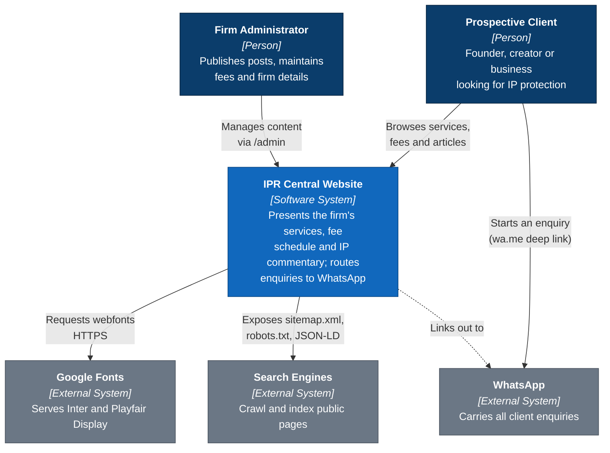
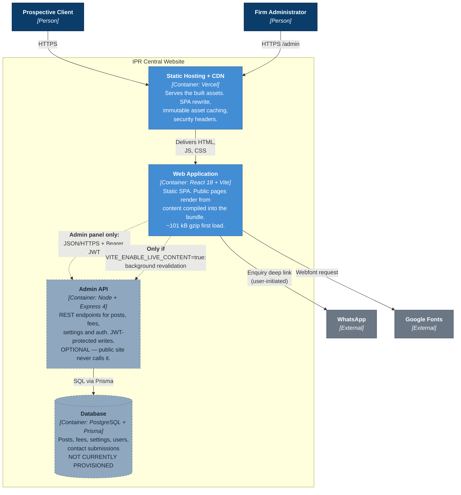
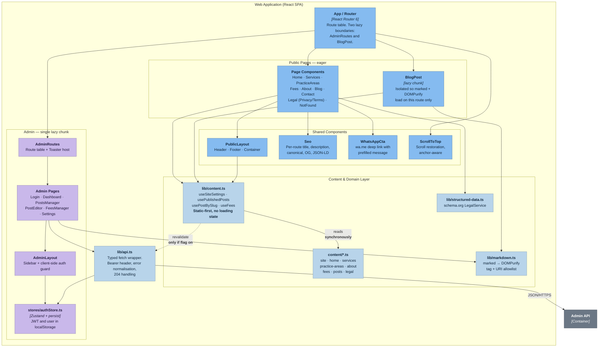
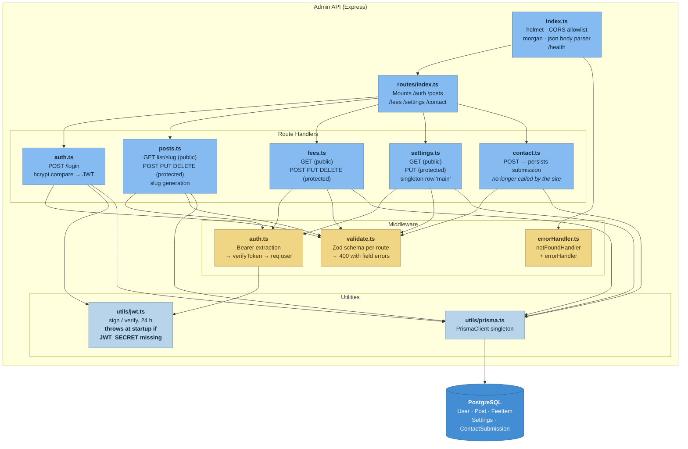
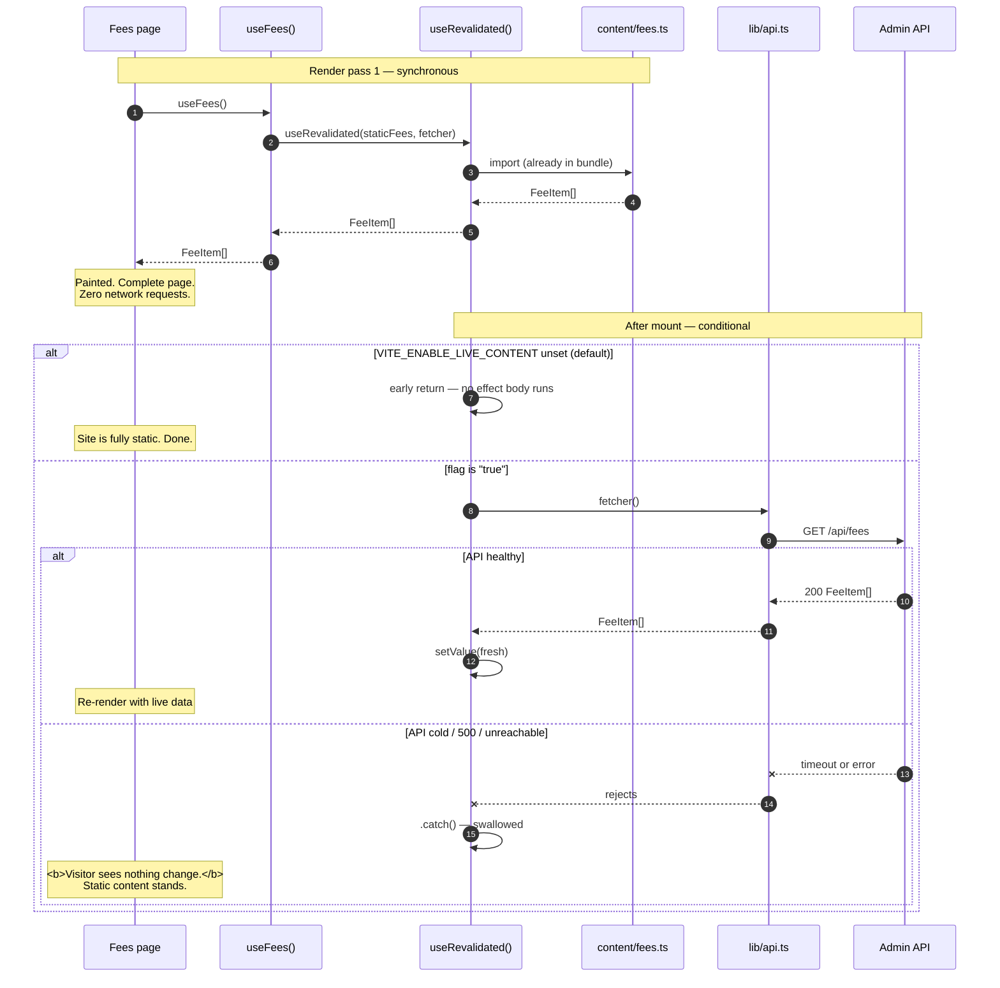
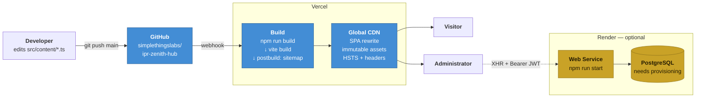

# C4 Model Diagrams

> Architecture of the IPR Central website at the four levels of the
> [C4 model](https://c4model.com): **Context → Container → Component → Code**.
>
> Each level zooms into one box from the level above. Diagrams render natively on
> GitHub and in the published artifact.
>
> Companion: [ARCHITECTURE.md](ARCHITECTURE.md) explains *why* the structure is
> shaped this way.

---

## Level 1 — System Context

Who uses the system and what it depends on.



**Note the absence of a payment provider, analytics platform, chat widget or
email service.** The system collects nothing from visitors, which is what makes
the privacy position in `src/content/legal.ts` factually accurate.

---

## Level 2 — Containers

The deployable units inside the system boundary.



### The critical property

The two **dotted** edges into the API are the entire difference between this
architecture and the previous one.

| Path | Previously | Now |
|---|---|---|
| Public page → API | **Solid. Blocking.** Page could not render until it resolved. | **Absent by default.** |
| Admin panel → API | Solid | Solid — unchanged |

Because no solid line runs from a public page to the API or the database, **the
public site's availability is the CDN's availability.** The API being cold, slow,
broken or entirely absent is invisible to visitors.

### Container responsibilities

| Container | Technology | Responsibility |
|---|---|---|
| Web Application | React 18, TypeScript, Vite 5, Tailwind 3 | Renders all pages. Owns content in `src/content/`. Client-side routing. |
| Static Hosting + CDN | Vercel | Serves `dist/`. SPA rewrite so deep links resolve. Cache and security headers per `vercel.json`. |
| Admin API | Express 4, Prisma 5, JWT | CRUD for posts/fees/settings. Zod validation, bcrypt auth, CORS allowlist. |
| Database | PostgreSQL | Persists admin-managed content. |

---

## Level 3 — Components (Web Application)

Inside the Web Application container.



### Reading the diagram

- **`lib/content.ts` is the seam.** Every public page depends on it; none imports
  `lib/api.ts` directly. That is what makes the static guarantee enforceable
  rather than a convention — adding a blocking fetch to a page means bypassing
  the layer deliberately.
- **`content/*.ts` has no inbound arrow from the API.** It is build-time data.
- **The admin subgraph touches `lib/api.ts` directly.** It is not static-first,
  because an editor must see real database state.
- **`lib/markdown.ts` is shared** by the public blog and the admin preview, so
  both are sanitised by the same allowlist and render identically.

---

## Level 3b — Components (Admin API)



---

## Level 4 — Code: the content resolution path

The mechanism that eliminated the loading states. This is the one piece of code
worth reading at this level, because the whole architecture rests on it.



### Why the type signature matters

```ts
function useRevalidated<T>(initial: T, fetcher: () => Promise<T>): T
```

The return type is `T` — not `{ data: T; isLoading: boolean; error: Error | null }`.

There is no loading flag to branch on and no error to render, so a page
*cannot* reintroduce a blocking spinner without deliberately bypassing this
layer. The old code had six independent copies of the
`isLoading → spinner / error → retry button / data → content` triangle, each
subtly different; one of them rendered a second, duplicated 130-line copy of the
footer as its loading state. Removing the states from the type removed the
possibility of that class of bug.

---

## Deployment view



The frontend pipeline is complete and verified. The Render half is drawn in amber
because the database it needs does not currently exist — see
[DEPLOYMENT.md](DEPLOYMENT.md#restoring-the-api).
